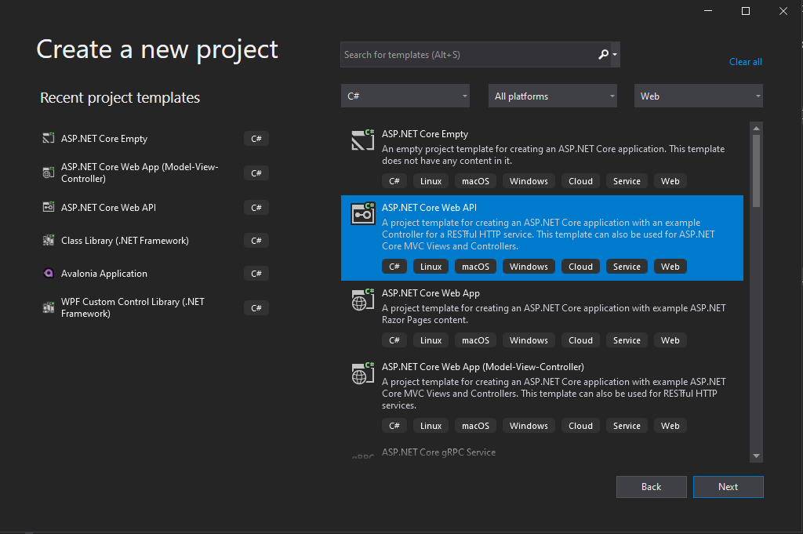
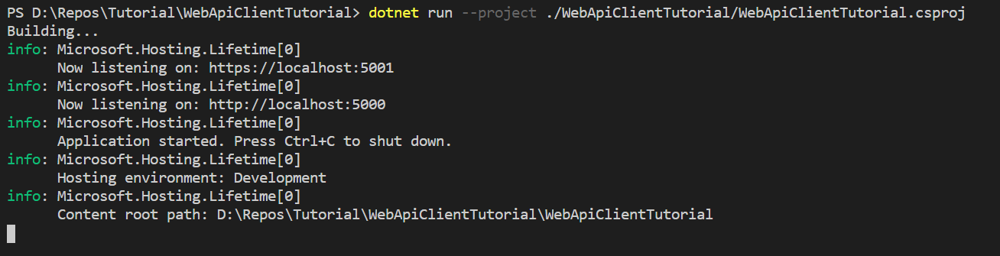

# Consul Client

Segue tutorial de como produzir um web Client que se registra e desregistra automaticamente do consul.

## Criando  o projeto

Mostraremos como criar o menor projeto possível de modo que o cliente se registre automaticamente ao consul.

Mostraremos o processo de criação pelo visual studio e por linha de comando.

### 1. Visual studo 

Crie um projeto novo usando a opção de ASP .NET Core Empty, conforme a imagem, nomei como WebApiClientTutorial e clique next, não mude nenhuma opção se houver e crie o projeto.



Agora execute o projeto e veja o funcionando.

### 2. Linha de comando

Ou altenativamente faça para cria a pasta onde será salva a solução, depois para criar a solução do projeto, finalmente para criar o projeto básico a ser usado, por fim adiciono o projeto a solucão com 

```sh
mkdir WebApiClientTutorial
cd WebApiClientTutorial
dotnet new sln
mkdir WebApiClientTutorial
cd WebApiClientTutorial
dotnet new webapi
cd ..
dotnet sln add ./WebApiClientTutorial/WebApiClientTutorial.csproj
```
para testar execute 

```sh
dotnet restore
dotnet run --project ./WebApiClientTutorial/WebApiClientTutorial.csproj
```

Deverá ter como resultado algp parecido com:

Vá até o seu navegador e execute [https://localhost:5001/weatherforecast](https://localhost:5001/weatherforecast) ou [http://localhost:5000/weatherforecast](http://localhost:5000/weatherforecast)

O resultado será uma tela escrito Hello World.

## Pacotes

* Ocelot 

[Nuget Consul](https://www.nuget.org/packages/Consul/)

[Github Consul](https://github.com/G-Research/consuldotnet)

Instale Ocelot e suas dependencias usando 

1.  package manager   
```
Install-Package Consul -Version 1.6.1.1
```
2. DOTNET CLI
```
dotnet add package Consul --version 1.6.1.1
```
3. Package Reference
```xml
<PackageReference Include="Consul" Version="1.6.1.1" />
```

## Codificando

Crie a pasta/namespace `Configuration/Consul` para organizarmos o código.

crie a classe `ConsulOptions.cs` e acrescente o seguinte código


```c#
using System;
using System.Collections.Generic;

namespace WebClientConsul.Configuration.Consul
{
    public class ConsulOptions
    {
        public string Id { get; set; } = Guid.NewGuid().ToString();
        public bool Enabled { get; set; }
        public string Host { get; set; } = "http://127.0.0.1:8500/";
        public string Service { get; set; }
        public string Address { get; set; }
        public int Port { get; set; }
        public bool PingEnabled { get; set; }
        public string[] Tags { get; set; }
        public IDictionary<string, string> MetaData { get; set; }
    }
}
```

crie a classe static `ConsulStartup.cs`


```c#
using Consul;
using Microsoft.AspNetCore.Builder;
using Microsoft.Extensions.Configuration;
using Microsoft.Extensions.DependencyInjection;
using Microsoft.Extensions.Diagnostics.HealthChecks;
using Microsoft.Extensions.Hosting;
using System;

namespace WebClientConsul.Configuration.Consul
{
    public static class ConsulStartup
    {
        public static IServiceCollection AddConsul(this IServiceCollection services, IConfiguration configuration)
        {
            services.Configure<ConsulOptions>(options => configuration.GetSection("consul").Bind(options));

            var consulConfig = services.BuildServiceProvider().GetRequiredService<Microsoft.Extensions.Options.IOptions<ConsulOptions>>().Value;

            services.AddSingleton(consulConfig);
            services.AddHealthChecks();
            services.AddSingleton<IConsulClient>(c => new ConsulClient(cfg =>
           {
               cfg.Address = new Uri(consulConfig.Host);
           }));
            return services;
        }

        public static IApplicationBuilder UseConsul(this IApplicationBuilder app)
        {
            using var scope = app.ApplicationServices.CreateScope();

            var consulOptions = scope.ServiceProvider.GetRequiredService<ConsulOptions>();
            var lifetime = scope.ServiceProvider.GetRequiredService<IHostApplicationLifetime>();
            var client = scope.ServiceProvider.GetRequiredService<IConsulClient>();

            if (!consulOptions.Enabled)
                return app;

            if (string.IsNullOrEmpty(consulOptions.Service))
                throw new ConsulConfigurationException("Service deve ter um nome");

            if (consulOptions.Port == 0)
                throw new ConsulConfigurationException("Service deve ter uma porta");

            if (string.IsNullOrEmpty(consulOptions.Address))
                throw new ConsulConfigurationException("Service deve ter um Address");

            var consulServiceId = $"{consulOptions.Service}:{consulOptions.Id}";

            var consulServiceRegistration = new AgentServiceRegistration
            {
                Name = consulOptions.Service,
                ID = consulServiceId,
                Address = consulOptions.Address,
                Port = consulOptions.Port,
                Tags = consulOptions.Tags,
                Meta = consulOptions.MetaData,
            };

            if (consulOptions.PingEnabled)
            {
                var healthService = scope.ServiceProvider.GetRequiredService<HealthCheckService>();

                if (healthService != null)
                {
                    var scheme =
                        consulOptions.Address.StartsWith("http", StringComparison.InvariantCultureIgnoreCase)
                        ? string.Empty
                        : "https://";

                    var test = $"{scheme}{consulOptions.Address}:{(consulOptions.Port > 0 ? consulOptions.Port : string.Empty)}/health";

                    var checkHTTP = new AgentServiceCheck
                    {

                        Interval = TimeSpan.FromSeconds(5),
                        DeregisterCriticalServiceAfter = TimeSpan.FromSeconds(10),
                        HTTP = test,
                        TCP = "localhost:5001",
                    };

                    var checkTCP = new AgentServiceCheck
                    {
                        Interval = TimeSpan.FromSeconds(5),
                        DeregisterCriticalServiceAfter = TimeSpan.FromSeconds(10),
                        TCP = "localhost:5001"
                    };
                    var check = new AgentCheckRegistration()
                    {
                        HTTP = test,
                        Notes = "Checks /health/status on localhost",
                        Timeout = TimeSpan.FromSeconds(3),
                        Interval = TimeSpan.FromSeconds(10)
                    };

                    consulServiceRegistration.Checks = new[] { checkTCP, checkHTTP, check };
                }
                else
                {
                    throw new ConsulConfigurationException("Verifique os parametros de configuração do consul");
                }

            }
            client.Agent.ServiceDeregister(consulServiceRegistration.ID).Wait();
            client.Agent.ServiceRegister(consulServiceRegistration);

            lifetime.ApplicationStopping.Register( () =>  client.Agent.ServiceDeregister(consulServiceRegistration.ID).Wait());

            return app;
        }
    }
}
```

Adicione ao `appsettings.json`

```json
"Consul": {
    "Id": "WebClientConsulId",
    "Host": "http://localhost:8500/",
    "Enabled": true,
    "Service": "WebClientConsul",
    "address": "localhost",
    "Port": 5001,
    "PingEnabled": true,
    "Tags": [ "consul", "client", "web" ],
    "MetaData": {
        "type": "MyJsonDictionaryOfstringanyType:#Json_Dictionary_Test",
        "Street": "30 Rockefeller Plaza",
        "City": "New York City",
        "State": "NY"
    }
}
```

e finalmente adicione ao `Startup.cs`


```c#
public void ConfigureServices(IServiceCollection services)
{
    // outros metodos omitidos
    services.AddConsul(Configuration);
}
```

```c#
public void Configure(IApplicationBuilder app, IWebHostEnvironment env)
{
    // outros metodos omitidos
    app.UseEndpoints(endpoints => 
    { 
        endpoints.MapControllers();
        endpoints.MapHealthChecks("/health");
    });

    app.UseConsul();
}
```


## Test

Para executar e verificar se está funcionando corretamente é necessário executar o consul, na pasta docker há um exemplo de docker-compose de consul.yml de desenvolvimento funcional do consul para tal basta executar 

```docker
docker-compose -f ./docker/consul.yml -d up 
```

caso por algum motivo não funcione instale o consul seguinto o tutorial da Hashcorp [Getting Started](https://learn.hashicorp.com/collections/consul/getting-started)

por fim execute a aplicação e veja o cliente se registrando em [http://localhost:8500/ui](http://localhost:8500/ui)

## Docker network 

É necessário criar uma network externa para que o docker-compose funcione corretamente, segue abaixo o comando mmínimo.

```
docker network create -d bridge compuletra
```